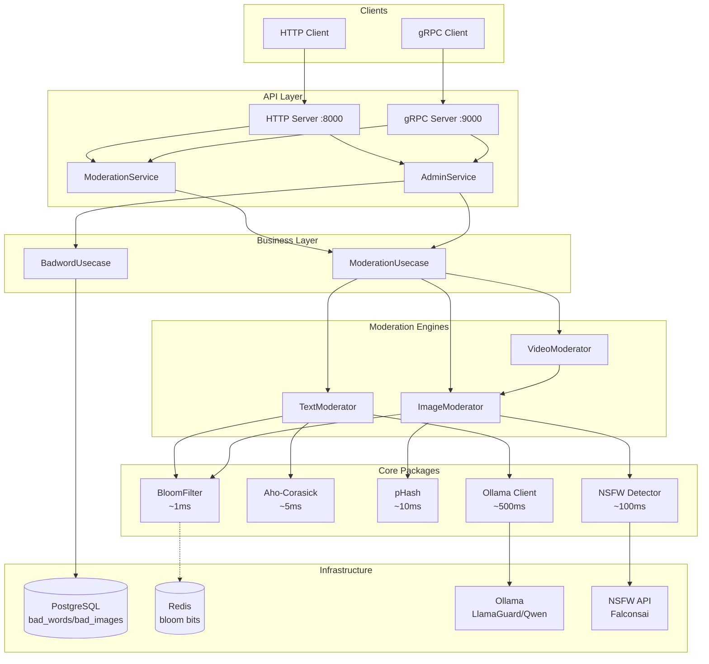
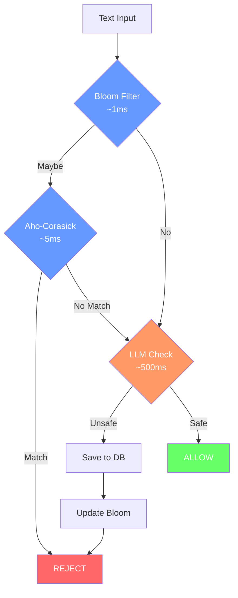
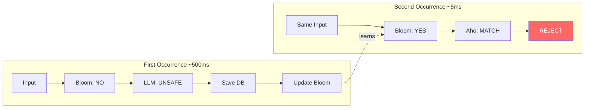
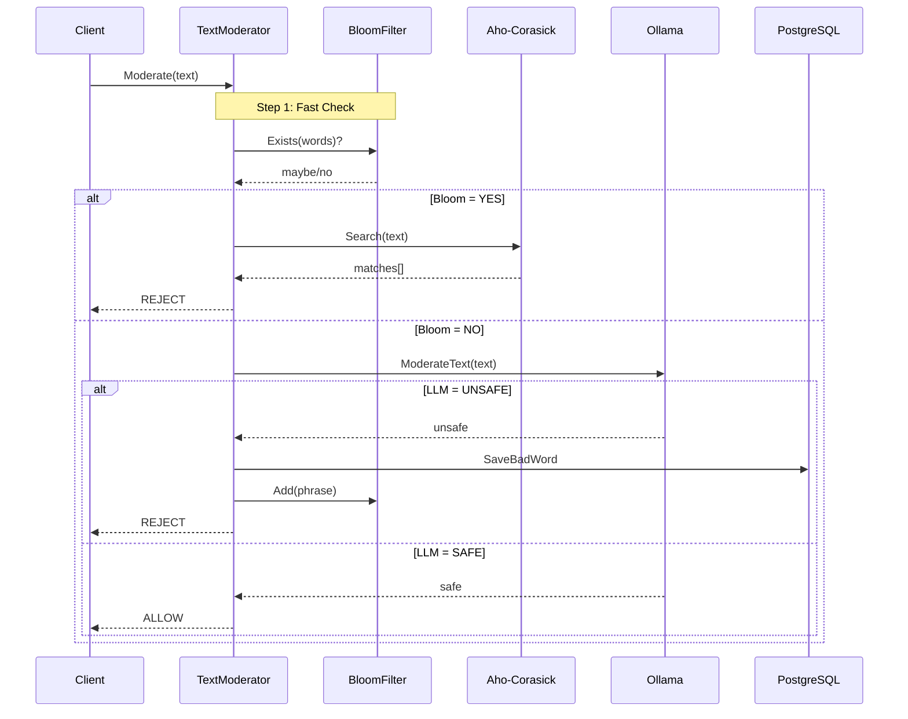

# Content Moderation Service - Architecture

## System Overview



## Moderation Flow



## Feedback Loop



## Text Moderation Sequence



## Package Structure

```
moderation/
├── internal/
│   ├── biz/                   # Business logic
│   │   ├── moderation.go
│   │   └── badword.go
│   ├── pkg/                   # Core packages
│   │   ├── bloom/             # Redis Bloom filter
│   │   ├── filter/            # Aho-Corasick
│   │   ├── hash/              # pHash
│   │   ├── llm/               # Ollama client
│   │   └── moderator/         # Engines
│   ├── service/
│   └── data/
└── docker-compose.yml
```

## Components

| Component | Purpose | Latency |
|-----------|---------|---------|
| BloomFilter | Fast probabilistic check | ~1ms |
| Aho-Corasick | Multi-pattern matching | ~5ms |
| pHash | Image duplicate detection | ~10ms |
| VLLM | Deep content analysis | ~50ms |
| Ollama LLM (Optional) | Deep content analysis | ~500ms |

## Docker Stack

```yaml
services:
  ollama:       # LLM Server (11434)
  postgres:     # Database (5432)
  redis:        # Bloom Filter (6379)
  moderation:   # Service (8000/9000)
```

## Performance Summary

| Occurrence | Path | Latency |
|------------|------|---------|
| First | Bloom→Aho→LLM→Save | ~500ms |
| Second+ | Bloom→Aho | ~5ms |

